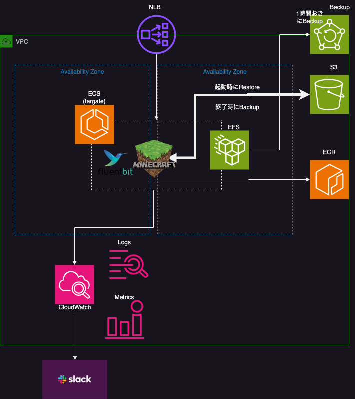

[](https://github.com/ShotaroMatsuya/minecraft-server-automation/actions/workflows/drift.yml)
[](https://github.com/ShotaroMatsuya/minecraft-server-automation/actions/workflows/build_image.yml)
[](https://github.com/ShotaroMatsuya/minecraft-server-automation/actions/workflows/schedule_job.yml)
[](https://github.com/ShotaroMatsuya/minecraft-server-automation/actions/workflows/terraform_ci.yml)
[](https://github.com/ShotaroMatsuya/minecraft-server-automation/actions/workflows/apply.yml)
# minecraft-server-automation

Build a minecraft container execution environment using terraform.  

## Main Feature

It mainly supports local provisioning.  
Since it uses personal resources, it is divided into two terraform.states as below considering the cost.  

#### keeping

Resources that do not cost much even if they are constantly running are defined as `keeping` resources.

#### scheduling

For resources that incur running costs, automatically start or stop them on daily.　　
These are defined as `scheduling` resources.



## Other Feature

- Backup  
By customizing the entrypoint shell of the Dockerfile, it is possible to restore from the latest data from backup (S3) when starting, and automatically back up when stopping.  
Continuous backups to inexpensive object storage(AWS S3) eliminate the risk of data loss due to frequent container lifecycles.  
Those activities will be notified in own slack.

- Task definition mapped from yaml  
Improves operability by defining container environment variables in multiple yaml files　and mapping them with terraform.

- Restore  
By default restore is performed from the latest backup when the container starts (As mentioned earlier), it is also possible to restore world data from a specific recovery point via terraform variable.  
This is useful when you want to travel back in time to your precious world.


## Utilities

### ECS Exec実行

```bash
cl=$(aws ecs list-clusters | jq -r '.clusterArns[0]' )
prefix=`echo ${cl} | sed -E 's/.+cluster\///g' `
taskarn=$(aws ecs list-tasks --cluster ${cl} | jq -r '.taskArns[0]')
taskid=`echo ${taskarn} | sed -E 's/.+task\/.+\///g' `
CONTAINER_NAME="minecraft"

echo ${cl};     \
echo ${prefix} ; \
echo ${taskarn}; \
echo ${taskid};  \
echo ${CONTAINER_NAME};  \

aws ecs execute-command  \
 --region    ap-northeast-1 \
 --cluster   ${cl} \
 --task      ${taskarn} \
 --container ${CONTAINER_NAME}\
 --command "/bin/sh" \
 --interactive
```

### Simple Load Test

CPU load by repeatedly hitting the yes command

```bash
yes > /dev/null &
yes > /dev/null &
yes > /dev/null &
yes > /dev/null &
yes > /dev/null &
```

```bash
$ jobs
[1]   実行中               yes > /dev/null &
[2]   実行中               yes > /dev/null &
[3]   実行中               yes > /dev/null &
[4]   実行中               yes > /dev/null &
[5]   実行中               yes > /dev/null &
```

```bash
$ kill %1 %2 %3
[1] 終了しました yes > /dev/null
[2]- 終了しました yes > /dev/null
[3]+ 終了しました yes > /dev/null
```

The process that consumes 500MB of memory for each press of Enter is described as follows

```bash
(load-memory.sh)
#! /bin/bash
# "--bytest 5000000" is 500MB.
echo PID=$$
echo -n "[ Enter : powerup! ] , [ Ctrl+d : stop ]"
c=0
while read byte; do
   eval a$c'=$(head --bytes 5000000 /dev/zero |cat -v)'
   c=$(($c+1))
   echo -n ">"
done
echo
```

#### Run the script as follows

```bash
chmod +x load-memory.sh
./load-memory.sh
```

### Restart ECS Cluster
```bash
cl=$(aws ecs list-clusters | jq -r '.clusterArns[0]' )
svc=$(aws ecs list-services --cluster ${cl} | jq -r '.serviceArns[0]' | sed -E 's/.+cluster\///g')

aws ecs update-service --force-new-deployment --cluster ${cl} --service ${svc}

```

### Bulk deletion of all backup vaults
```bash
aws backup list-backup-jobs | jq -r '.BackupJobs[] | select(.BackupVaultName == "minecraft-vault" )' | jq -r '.RecoveryPointArn' | xargs -L 1 aws backup delete-recovery-point --backup-vault-name minecraft-vault --recovery-point-arn
```

### Confirm environment variables in local
```bash
docker compose run --rm mc env
```
