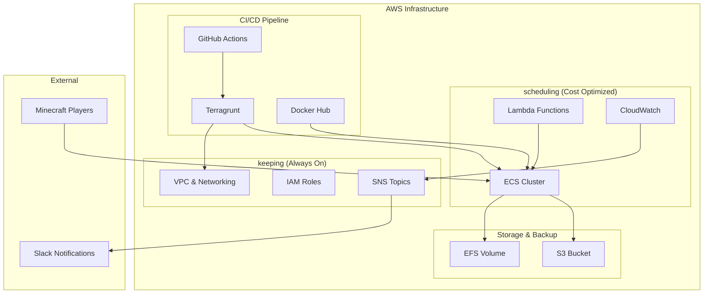

[](https://github.com/ShotaroMatsuya/minecraft-server-automation/actions/workflows/drift.yml)
[](https://github.com/ShotaroMatsuya/minecraft-server-automation/actions/workflows/build_image.yml)
[](https://github.com/ShotaroMatsuya/minecraft-server-automation/actions/workflows/schedule_job.yml)
[](https://github.com/ShotaroMatsuya/minecraft-server-automation/actions/workflows/terragrunt-pr-check.yml)

# 🎮 Minecraft Server Infrastructure on AWS

Cost-optimized Minecraft server infrastructure using **Terragrunt** for multi-environment management and automated CI/CD.

## 🏗️ Architecture Overview

This infrastructure is divided into two environments to optimize costs and maintainability:

### keeping
Resources that do not cost much even if they are constantly running:
- **VPC & Networking**: Subnets, Security Groups, NAT Gateway
- **IAM Roles & Policies**: Service authentication and permissions
- **SNS Topics**: Notification channels for monitoring

### scheduling
Cost-optimized resources that automatically start/stop daily:
- **ECS Cluster & Service**: Minecraft server container
- **Lambda Functions**: Automation and scheduling
- **CloudWatch**: Monitoring and alerting




## ✨ Main Features

### 🔄 Automated Backup & Restore
By customizing the entrypoint shell of the Dockerfile, it is possible to restore from the latest data from backup (S3) when starting, and automatically back up when stopping. Continuous backups to inexpensive object storage (AWS S3) eliminate the risk of data loss due to frequent container lifecycles. Those activities will be notified in your Slack channel.

### 📋 Task Definition Mapped from YAML
Improves operability by defining container environment variables in multiple YAML files and mapping them with Terragrunt. This allows for easy configuration management across different environments.

### ⏰ Time Travel Restore
By default, restore is performed from the latest backup when the container starts. It is also possible to restore world data from a specific recovery point via Terragrunt variables. This is useful when you want to travel back in time to your precious world.

### 🚀 GitHub Actions CI/CD
- **Enhanced PR Validation**: Detailed Terragrunt plan output with resource counting
- **Security Scanning**: Trivy SAST analysis with SARIF reporting
- **Comment Management**: Prevents PR spam with comment updates
- **AWS OIDC**: Secure authentication without long-lived credentials

## 🎯 Dispatch Workflows

Advanced Minecraft world management via GitHub webhook triggers:

### Restore World from Backup

Restores Minecraft world from a specific backup file:

```bash
curl -X POST \
  -H "Accept: application/vnd.github.v3+json" \
  -H "Authorization: token $GITHUB_TOKEN" \
  https://api.github.com/repos/YOUR_OWNER/YOUR_REPO/dispatches \
  -d '{
    "event_type": "restore-and-set-recoverypoint",
    "client_payload": {
      "recovery_file": "world-backup-20241201-120000.tar.gz"
    }
  }'
```

### Create New World with Seed

Creates a new Minecraft world with specified seed value:

```bash
curl -X POST \
  -H "Accept: application/vnd.github.v3+json" \
  -H "Authorization: token $GITHUB_TOKEN" \
  https://api.github.com/repos/YOUR_OWNER/YOUR_REPO/dispatches \
  -d '{
    "event_type": "create-and-set-seed",
    "client_payload": {
      "seed_value": "1234567890"
    }
  }'
```

**Features:**

- 🔄 Automated ECS service restart
- 📢 Slack notifications
- ☁️ AWS OIDC authentication
- 🏗️ Terragrunt-based deployment

## 🚀 Quick Start

### Prerequisites

```bash
# Install aqua for tool management
curl -sSfL https://raw.githubusercontent.com/aquaproj/aqua-installer/v3.1.0/aqua-installer | bash
export PATH="${AQUA_ROOT_DIR:-${XDG_DATA_HOME:-$HOME/.local/share}/aqua}/bin:$PATH"

# Install tools
make install-tools
```

### Deploy

```bash
# Configure AWS
export AWS_ACCOUNT_ID=your-account-id
aws configure

# Deploy infrastructure
make tg-init
make tg-deploy-all

# Start server
make tg-start-minecraft
```

## 📋 Commands

| Command | Description |
|---------|-------------|
| `make tg-deploy-all` | Deploy all environments |
| `make tg-start-minecraft` | Start Minecraft server |
| `make tg-stop-minecraft` | Stop Minecraft server |
| `make tg-destroy-all` | Destroy all infrastructure |
| `make tg-plan-all` | Plan changes for all environments |
| `make tg-validate` | Validate Terragrunt configuration |
| `make install-tools` | Install development tools via aqua |

Run `make help` for the full command list.

## 🔧 AWS Setup

See [AWS OIDC Setup Guide](docs/aws-oidc-setup.md) for GitHub Actions authentication configuration.

## 🛠️ Utilities

### Simple Load Test

CPU load by repeatedly hitting the yes command:

```bash
yes > /dev/null &
yes > /dev/null &
yes > /dev/null &
yes > /dev/null &
yes > /dev/null &
```

Check running processes:
```bash
$ jobs
[1]   実行中               yes > /dev/null &
[2]   実行中               yes > /dev/null &
[3]   実行中               yes > /dev/null &
[4]   実行中               yes > /dev/null &
[5]   実行中               yes > /dev/null &
```

Kill processes:
```bash
$ kill %1 %2 %3
[1] 終了しました yes > /dev/null
[2]- 終了しました yes > /dev/null
[3]+ 終了しました yes > /dev/null
```

### Memory Load Test

Process that consumes 500MB of memory for each press of Enter:

```bash
#!/bin/bash
# load-memory.sh
# "--bytes 5000000" is 500MB.
echo PID=$$
echo -n "[ Enter : powerup! ] , [ Ctrl+d : stop ]"
c=0
while read byte; do
   eval a$c'=$(head --bytes 5000000 /dev/zero |cat -v)'
   c=$(($c+1))
   echo -n ">"
done
echo
```

Run the script:
```bash
chmod +x load-memory.sh
./load-memory.sh
```

### Bulk Deletion of All Backup Vaults

```bash
aws backup list-backup-jobs | jq -r '.BackupJobs[] | select(.BackupVaultName == "minecraft-vault" )' | jq -r '.RecoveryPointArn' | xargs -L 1 aws backup delete-recovery-point --backup-vault-name minecraft-vault --recovery-point-arn
```

### ECS Exec Execution

```bash
cl=$(aws ecs list-clusters | jq -r '.clusterArns[0]' )
prefix=`echo ${cl} | sed -E 's/.+cluster\///g' `
taskarn=$(aws ecs list-tasks --cluster ${cl} | jq -r '.taskArns[0]')
taskid=`echo ${taskarn} | sed -E 's/.+task\/.+\///g' `
CONTAINER_NAME="minecraft"

echo ${cl}
echo ${prefix}
echo ${taskarn}
echo ${taskid}
echo ${CONTAINER_NAME}

aws ecs execute-command \
 --region ap-northeast-1 \
 --cluster ${cl} \
 --task ${taskarn} \
 --container ${CONTAINER_NAME} \
 --command "/bin/sh" \
 --interactive
```

### Confirm Environment Variables Locally

```bash
docker compose run --rm mc env
```

## 🏷️ Technology Stack

- **Infrastructure as Code**: Terragrunt 0.67.16 + Terraform 1.9.8
- **Container Orchestration**: AWS ECS with Fargate
- **CI/CD**: GitHub Actions with AWS OIDC
- **Security**: Trivy SAST scanning, TFLint validation
- **Monitoring**: CloudWatch + SNS + Slack integration
- **Tool Management**: aqua package manager
- **Code Quality**: ShellCheck, actionlint

## 📊 Cost Optimization

This infrastructure is designed with cost optimization in mind:

1. **Scheduled Start/Stop**: Automatically starts at 19:00 JST and stops at 01:00 JST
2. **Spot Instances**: Uses EC2 Spot pricing where possible
3. **Efficient Storage**: EFS for persistent world data, S3 for backups
4. **Resource Separation**: Critical infrastructure (`keeping`) vs. workload (`scheduling`)

## 🔒 Security Features

- **AWS OIDC Authentication**: No long-lived credentials in GitHub
- **SAST Scanning**: Trivy security analysis on every PR
- **Least Privilege IAM**: Minimal required permissions
- **Encrypted Storage**: EFS and S3 encryption at rest
- **Network Security**: VPC with security groups

## 📝 Development

This project uses:
- **aqua**: Tool version management
- **pre-commit**: Git hooks for code quality
- **GitHub Actions**: Automated testing and deployment
- **Terragrunt**: DRY infrastructure management

For development setup, see the [Development Guide](docs/development.md).
