[](https://github.com/ShotaroMatsuya/minecraft-server-automation/actions/workflows/drift.yml)
[](https://github.com/ShotaroMatsuya/minecraft-server-automation/actions/workflows/build_image.yml)
[](https://github.com/ShotaroMatsuya/minecraft-server-automation/actions/workflows/schedule_job.yml)
[](https://github.com/ShotaroMatsuya/minecraft-server-automation/actions/workflows/terraform_ci.yml)
[](https://github.com/ShotaroMatsuya/minecraft-server-automation/actions/workflows/apply.yml)

# 🎮 Minecraft Server Infrastructure on AWS

A robust, cost-optimized Minecraft server infrastructure deployed on AWS using Terragrunt for multi-environment management.

## 📖 Project Overview

### Environment-Based Architecture
- **keeping**: Persistent infrastructure (VPC, IAM, SNS, etc.)
- **scheduling**: Cost-optimized resources (ECS, Lambda, etc.)

### Key Benefits
- 🏗️ **Terragrunt**: Centralized module versioning and configuration
- 💰 **Cost-Optimized**: Automatic start/stop scheduling
- 📊 **Monitoring**: CloudWatch logs, SNS notifications  
- 🔄 **GitOps**: Infrastructure as Code with version control
- 🛡️ **Security**: IAM roles, security groups, encrypted storage
- 📦 **Backup**: Automatic S3 backup with restore capabilities
- 🔧 **ECS Exec**: Remote container access for debugging

## 🚀 Quick Start

### Prerequisites

#### Tool Version Management with aqua
This project uses [aqua](https://aquaproj.github.io/) for consistent tool version management.

```bash
# Install aqua (choose one method)
curl -sSfL https://raw.githubusercontent.com/aquaproj/aqua-installer/v3.1.0/aqua-installer | bash

# Or via Homebrew (macOS)
brew install aquaproj/aqua/aqua

# Add to PATH (add this to your shell profile)
export PATH="${AQUA_ROOT_DIR:-${XDG_DATA_HOME:-$HOME/.local/share}/aqua}/bin:$PATH"

# Install all tools defined in aqua.yaml
make install-tools
```

#### Managed Tools
- **Terraform**: v1.9.8
- **TFLint**: v0.53.0  
- **AWS CLI**: v2.17.57
- **jq**: v1.7.1
- **yq**: v4.44.3

### Deploy Infrastructure
```bash
# Set your AWS account ID
export AWS_ACCOUNT_ID=your-actual-account-id

# Configure AWS credentials  
aws configure

# Initialize Terragrunt (downloads modules, configures backends)
make tg-init

# Plan deployment (shows what will be created)
make tg-plan-all

# Deploy infrastructure (keeping → scheduling)
make tg-deploy-all

# Start minecraft server
make tg-start-minecraft
```

## 📋 Available Commands

| Command | Description |
|---------|-------------|
| `make tg-init` | Initialize Terragrunt workspaces |
| `make tg-plan-all` | Plan all environments |
| `make tg-deploy-all` | Deploy keeping → scheduling |
| `make tg-start-minecraft` | Start minecraft server |
| `make tg-stop-minecraft` | Stop minecraft server |
| `make tg-destroy-all` | Destroy all infrastructure |
| `make tg-validate-all` | Validate all configurations |

Run `make help` to see all available commands organized by category.

## 🏗️ Architecture

### Environment Dependencies

```mermaid
graph TB
    subgraph "keeping Environment (Persistent Infrastructure)"
        VPC["🌐 VPC<br/>Network Infrastructure<br/>Public Subnets<br/>Security Groups"]
        IAM["🔐 IAM Roles<br/>ECS Task Role<br/>Task Execution Role<br/>ChatBot Role<br/>GitHub Actions Role"]
        SNS["📢 SNS Topic<br/>Notification Hub<br/>KMS Encrypted"]
        KMS["🔐 KMS Key<br/>SNS Encryption<br/>CloudWatch Integration"]
        ChatBot["💬 AWS ChatBot<br/>Slack Integration<br/>Notification Routing"]
        SlashCmd["⚡ Slash Command<br/>Lambda Function<br/>GitHub Integration"]
        
        VPC -.-> IAM
        SNS --> KMS
        SNS --> ChatBot
        IAM --> ChatBot
        IAM --> SlashCmd
    end

    subgraph "scheduling Environment (Cost-Optimized Resources)"
        ECS["🐳 ECS Cluster<br/>Fargate Service<br/>Minecraft Container<br/>FluentBit Logging"]
        NLB["⚖️ Network Load Balancer<br/>Port 25565 Minecraft<br/>Port 8080 Web Map<br/>Health Checks"]
        Domain["🌍 Domain Management<br/>Route53 Records<br/>SSL Certificates"]
        CloudWatch["📊 CloudWatch<br/>Log Groups<br/>Alarms<br/>Metrics"]
        Lambda["⚡ Lambda Functions<br/>Log Processing<br/>Error Notifications<br/>Slack Alerts"]
        
        NLB --> ECS
        Domain --> NLB
        ECS --> CloudWatch
        CloudWatch --> Lambda
    end

    %% Dependencies from scheduling to keeping
    ECS -.->|uses| VPC
    ECS -.->|uses| IAM
    CloudWatch -.->|publishes to| SNS
    Lambda -.->|publishes to| SNS
    Lambda -.->|decrypts with| KMS

    %% Data flow
    Internet(("🌐 Internet")) --> Domain
    Domain --> NLB
    NLB --> ECS
    ECS --> CloudWatch
    CloudWatch --> SNS
    SNS --> ChatBot
    ChatBot --> Slack(("💬 Slack"))

    classDef keeping fill:#e1f5fe,stroke:#0277bd,stroke-width:2px
    classDef scheduling fill:#f3e5f5,stroke:#7b1fa2,stroke-width:2px
    classDef external fill:#fff3e0,stroke:#f57c00,stroke-width:2px

    class VPC,IAM,SNS,KMS,ChatBot,SlashCmd keeping
    class ECS,NLB,Domain,CloudWatch,Lambda scheduling
    class Internet,Slack external
```



**Key Dependencies:**
- **scheduling** environment uses Terraform `data` sources to reference resources from **keeping**
- **VPC**: Provides network infrastructure for ECS tasks
- **IAM Roles**: Used by ECS tasks and Lambda functions
- **SNS Topic**: Receives notifications from CloudWatch alarms and Lambda functions
- **KMS Key**: Decrypts SNS messages for Lambda processing

Terragrunt automatically handles this dependency order during deployment, ensuring **keeping** deploys before **scheduling**.

## ⚙️ Configuration

### Terragrunt Structure
```
terragrunt/
├── terragrunt.hcl              # Root config with module versions
└── environments/
    ├── keeping/terragrunt.hcl  # Persistent infrastructure  
    └── scheduling/terragrunt.hcl # Cost-optimized resources
```

Module versions are centrally managed in the root `terragrunt.hcl` file for consistency across environments.

## 🎮 Daily Operations

### Start/Stop Server
```bash
# Start server
make tg-start-minecraft

# Stop server (saves costs)
make tg-stop-minecraft
```

### Backup and Restore
- **Automatic Backup**: World data is automatically backed up to S3 when container stops
- **Automatic Restore**: Latest backup is restored when container starts
- **Point-in-time Recovery**: Restore from specific backup via terraform variables

### Remote Access
```bash
# Access running container for debugging
cl=$(aws ecs list-clusters | jq -r '.clusterArns[0]')
taskarn=$(aws ecs list-tasks --cluster ${cl} | jq -r '.taskArns[0]')

aws ecs execute-command \
 --cluster   ${cl} \
 --task      ${taskarn} \
 --container minecraft \
 --command "/bin/sh" \
 --interactive
```

## 🔧 Development

### Adding New Resources
1. Update module version in `terragrunt/terragrunt.hcl` if needed
2. Add configuration in appropriate environment
3. Test with `make tg-plan-all`
4. Deploy with `make tg-deploy-all`

### Debugging
```bash
# Validate all configurations  
make tg-validate-all

# Debug specific environment
cd terragrunt/environments/keeping
terragrunt plan --terragrunt-log-level debug
```

### Code Quality
```bash
# Format and validate code
make tg-validate
make fmt

# Run linting
tflint --recursive
```

## 🧪 Testing and Utilities

### Load Testing
```bash
# CPU load test
yes > /dev/null &  # Repeat 5 times for high CPU usage

# Memory load test
./scripts/load-memory.sh  # Allocates 500MB per Enter press
```

### Bulk Operations
```bash
# Delete all backup vault recovery points
aws backup list-backup-jobs | jq -r '.BackupJobs[] | select(.BackupVaultName == "minecraft-vault")' | \
jq -r '.RecoveryPointArn' | xargs -L 1 aws backup delete-recovery-point --backup-vault-name minecraft-vault --recovery-point-arn

# Check local Docker environment variables
docker compose run --rm mc env
```

## 📚 Documentation

- 📖 [Complete Deployment Guide](docs/DEPLOYMENT_GUIDE.md) - Detailed setup instructions
- 🔧 [Terragrunt Migration Notes](docs/TERRAGRUNT_MIGRATION.md) - Migration history

## 🤝 Contributing

1. Create feature branch
2. Test changes with `make tg-plan-all`
3. Submit pull request
4. Validate in staging environment

---

🎯 **Always use `tg-*` commands for this Terragrunt-managed infrastructure!**
# Test change for workflow validation
